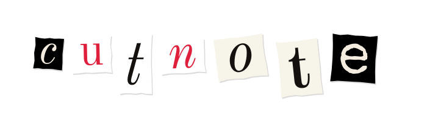
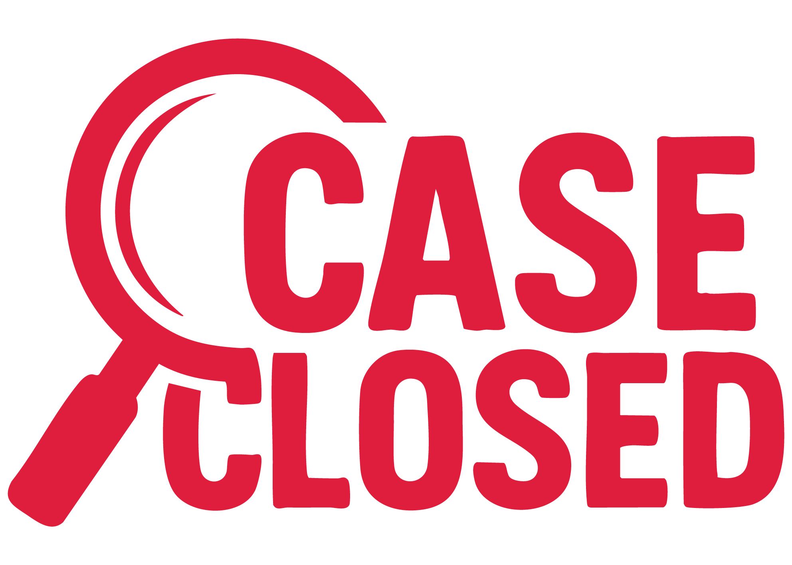
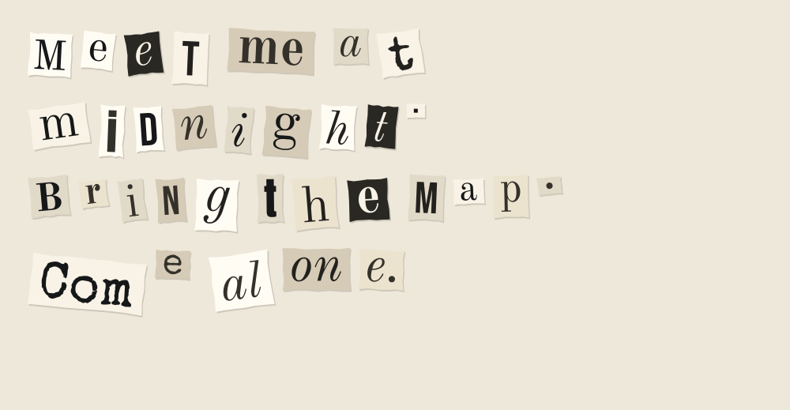
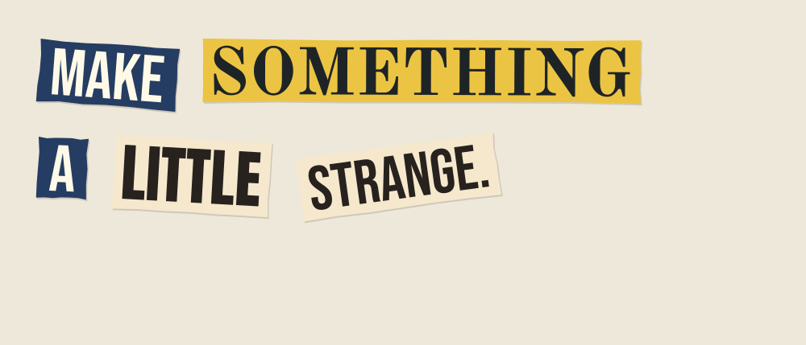
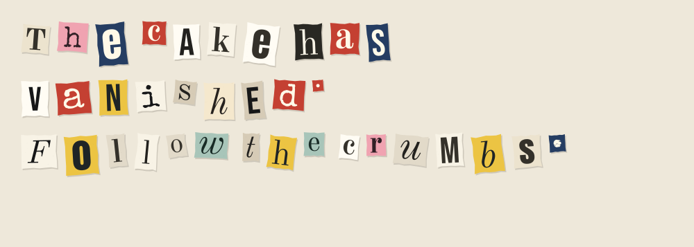
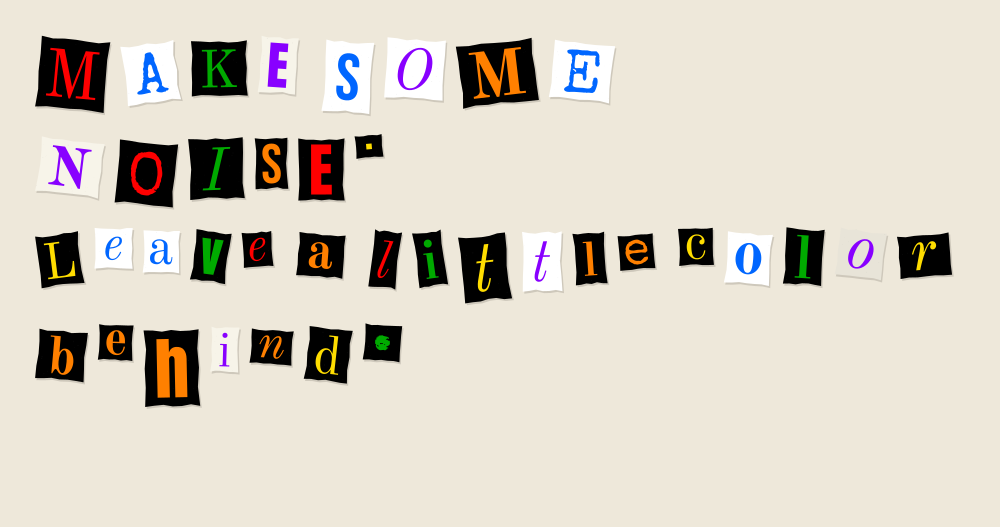
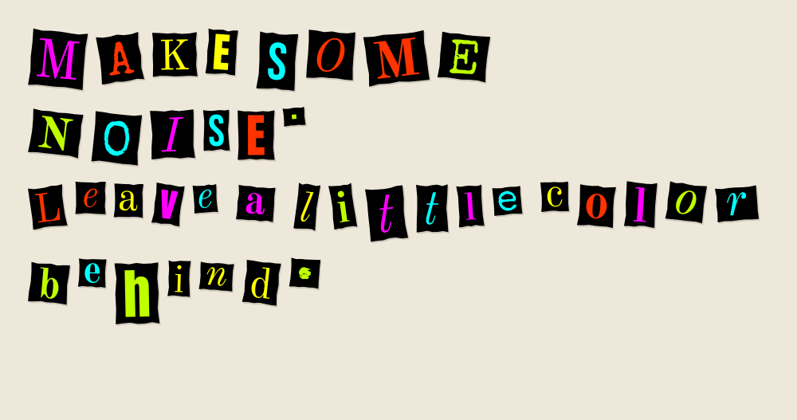

<p></p>

# Cutnote

A Python tool for making ransom-note lettering from newspaper and magazine
cutouts. Each letter, word, or fragment gets its own font and piece of paper.
The result is an SVG you can resize or print without losing detail.

Use it from the terminal, or open the local browser editor to try different
colors and layouts. Fonts come with the package.

## Proudly used by CaseClosed

<a href="https://caseclosed.no/"></a>

Proudly used by [CaseClosed](https://caseclosed.no/) in Norway and
[Caseclosed Mysteries](https://caseclosedmysteries.com/) internationally for
their printed murder mystery materials.

## Get started

You'll need Python 3.11 or newer and [uv](https://docs.astral.sh/uv/getting-started/installation/).
From this checkout:

```sh
uv run cutnote gui
uv run cutnote render "Meet me at midnight." -o note.svg
```

The editor opens in your browser. Click a color card, adjust the size, and
download the SVG when you're happy with it. **Custom** lets you add your own
colors with pickers or hex values. **Shuffle** tries a new arrangement; the
other controls keep the current seed while you edit.

The editor runs on your computer at `127.0.0.1`. Stop it with Ctrl+C in the
terminal. Once the dependencies are installed, it works offline.

To install Cutnote as a tool you can use from any directory:

```sh
uv tool install .
cutnote gui
cutnote render "Read between the lines." --seed 42
```

Or run it once from the checkout with `uvx --from . cutnote gui`. These
commands use the local project; `uvx cutnote` on its own would need a package
published on PyPI.

## A few examples

The text files and generated SVGs are in [examples/](examples/). Try changing
a message or seed to make your own version.

| Style | Message | Text file |
| --- | --- | --- |
| Newspaper | Meet me at midnight. Bring the map. Come alone. | [midnight.txt](examples/midnight.txt) |
| Magazine | MAKE SOMETHING A LITTLE STRANGE. | [make-something.txt](examples/make-something.txt) |
| Mixed | The cake has vanished. Follow the crumbs. | [missing-cake.txt](examples/missing-cake.txt) |
| Accented letters | Hemmelig møte. Ta med nøkkelen. Zażółć gęślą jaźń. | [accented-latin.txt](examples/accented-latin.txt) |
| Rainbow / neon | MAKE SOME NOISE. Leave a little color behind. | [colorful.txt](examples/colorful.txt) |

```sh
uv run cutnote render --file examples/midnight.txt --seed 42 --font-size 56 -o examples/newspaper.svg
uv run cutnote render --file examples/make-something.txt --preset magazine --mode words --font-size 72 --seed 17 -o examples/magazine.svg
uv run cutnote render --file examples/missing-cake.txt --preset mixed --mode letters --seed 99 -o examples/mixed.svg
uv run cutnote render --file examples/accented-latin.txt --seed 7 -o examples/accented-latin.svg
uv run cutnote render --file examples/colorful.txt --palette rainbow --mode letters --font-size 56 --seed 55 -o examples/rainbow.svg
uv run cutnote render --file examples/colorful.txt --palette neon --mode letters --font-size 56 --seed 55 -o examples/neon.svg
```











Other messages to try: “You found the first clue.”, “This invitation is
classified.”, or “TRUST THE WEIRD IDEAS.”

## Colors and paper sizes

Newspaper, Magazine, and Mixed keep the original paper-and-ink combinations.
The other palettes choose text colors: `black-and-white`, `primary`,
`rainbow`, `neon`, `warm`, `cool`, and `grayscale`. Their paper colors
adjust to keep the lettering readable.

For a custom palette, repeat `--color` with the colors you want. You can use
between 1 and 16 colors, written as `#RGB` or `#RRGGBB`.

```sh
cutnote render "MAKE SOME NOISE." --palette rainbow --mode letters -o rainbow.svg
cutnote render "Your colors." --color "#ff0044" --color "#0044ff" --color "#ffdd00" -o custom.svg
```

Sizes can be in pixels, millimeters, centimeters, inches, or points. A bare
number means pixels. The page height grows to fit the text unless you supply
`--height`. On a fixed page, a note that's too tall is scaled down rather
than cropped.

```sh
uv run cutnote render --file examples/midnight.txt --width 210mm --height 297mm --font-size 10mm --seed 42 -o examples/print-a4.svg
cutnote render "A smaller note." --width 15cm --font-size 0.8cm -o small.svg
```

[The A4 example](examples/print-a4.svg) is 210 × 297 mm. Print at **100% /
actual size** to keep those dimensions. SVG uses the
[standard conversion](https://www.w3.org/TR/css-values-4/#absolute-lengths)
of 96 pixels per inch; the on-screen preview isn't a physical ruler.

The editor has A4, A5, and US Letter buttons, plus separate units for page
size and lettering. Switching units converts the current values.

## Command-line options

`render` takes quoted text, a UTF-8 file through `--file`, or piped stdin.
Use one source at a time.

```sh
echo "Follow the crumbs." | cutnote render -o crumbs.svg
cutnote render "Transparent background." --background transparent -o clear.svg
cutnote render "SVG to stdout." -o -
cutnote gui --no-browser --port 8080
cutnote --help
```

| Option | What it does | Default |
| --- | --- | --- |
| `--preset` | Clipping style: `newspaper`, `magazine`, `mixed` | `newspaper` |
| `--palette` | Original style or a text color palette; `auto` matches the clipping style | `auto` |
| `--color` | Add a custom text color; repeat for more colors | None |
| `--mode` | Cut into `letters`, `words`, or a `mixed` selection | `mixed` |
| `--width` | Page width, 64–16,384 px or equivalent in other units | 1000 px |
| `--height` | Fixed page height in the same range, or `auto` | `auto` |
| `--font-size` | Letter size, 4–512 px or equivalent | 48 px |
| `--background` | `paper`, `white`, or `transparent` | `paper` |
| `--seed` | Number from 0 to 4,294,967,295 for a repeatable arrangement | Random |
| `--output`, `-o` | SVG file path; use `-` for stdout | `note.svg` |

Use `px`, `mm`, `cm`, `in`, or `pt` on a size. The seed and dimensions
are printed to stderr, so `-o -` gives you just the SVG on stdout. The same
text, settings, seed, and version of Cutnote produce the same file.

Line breaks and blank lines are kept. Extra horizontal whitespace becomes a
single space. Text is limited to 10,000 characters.

The bundled fonts support accented Latin letters, including Norwegian and
Polish. If a character is missing, Cutnote tells you which one. Emoji and
complex-script shaping aren't supported. Lettering is saved as paths; the
original text and settings are kept in SVG metadata.

## The logo

The logo is a Cutnote export too, with one row of letters in CaseClosed's
red (`#de203d`), ink (`#14110f`), and cream (`#f4ecdf`). To recreate it exactly:

```sh
uv run cutnote render cutnote --mode letters --preset newspaper --color "#de203d" --color "#14110f" --color "#f4ecdf" --font-size 88 --width 700 --background transparent --seed 42 -o src/cutnote/assets/web/logo.svg
```

That file is used in the editor header and at the top of this README. There
isn't a separate drawing step.

## Using it from Python

```python
from pathlib import Path
from cutnote import RenderOptions, render_note

note = render_note("Hemmelig møte.", RenderOptions(width="21cm", seed=42))
Path("note.svg").write_text(note.svg, encoding="utf-8")
```

## Working on Cutnote

```sh
uv sync --group dev
uv run pytest
uv run ruff check src tests
uv build
```

The CLI uses Typer. FontTools turns the bundled fonts into SVG paths, and the
editor shares the same renderer. Its HTML, CSS, and JavaScript are plain files;
there's no frontend build step.

The six font faces are Old Standard TT regular, bold, and italic, Anton,
Bebas Neue, and Special Elite. They're included in the source and wheel,
along with their licenses and source hashes under `src/cutnote/assets/fonts`.

The code is MIT licensed. The fonts keep their original OFL or Apache licenses.
